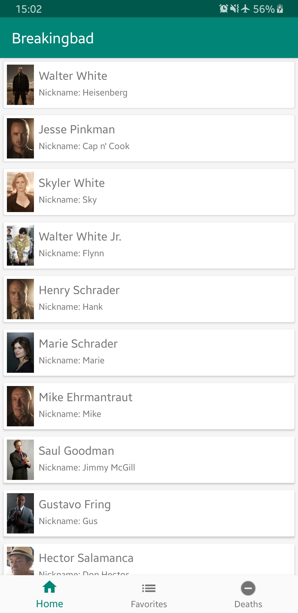
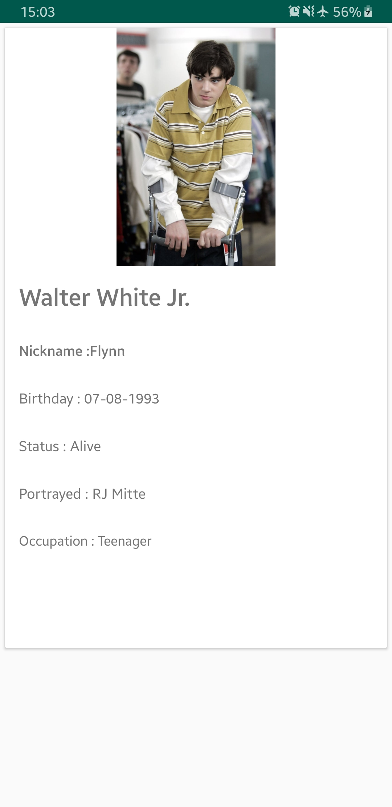
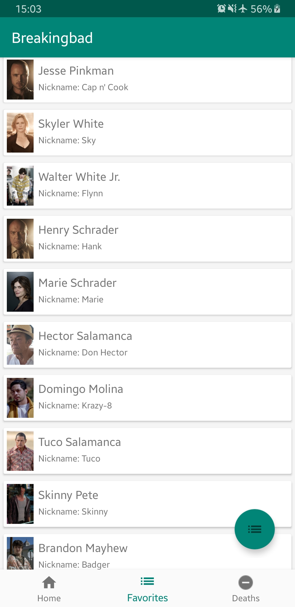
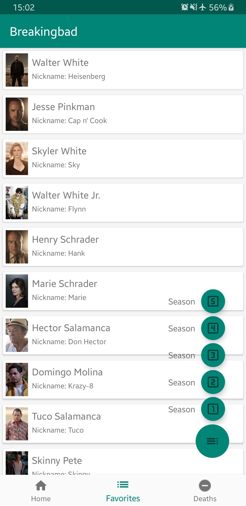
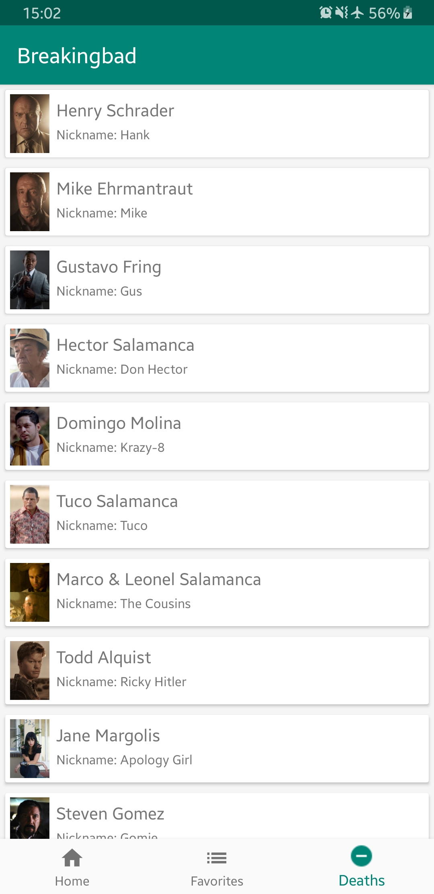

# Application BreakingBad


## Auteur

* Rémi Truong 4A CFA


## Présentation 
Simple projet démontrant l'utilisation de l'architecture MVC et d'appel REST d'une API dans une application android.

Cette application affiche la liste des personnages de la séries Breaking Bad.
Elle utilise une API qui permet de récupérer la liste des personnages présents dans la série.

## Prérequis

* Installation d'Android Studio ou IntelliJ
* Récupérer le projet 
```bash
git clone https://github.com/remitruong/breakingbad.git
```

## Fonctionnalités

* Architecture MVC
* Appel d'une API Rest
* Stockage des données en cache
* 5 écrans : 1 SplashScreen et 2 activités et 3 fragments
    - Affichage d'une liste dans un RecyclerView 
    - Affichage du détail de l'item de la liste
* Gitflow
* Animation entre les écrans
* Floating Menu déroulant une liste de floating button
* Floating Button
* Bottom Navigation Bar
* Utilisation de fragment
* Application des principes du design Material : 
    - CardView
    - Icon
    - liste
* Utilisation de plusieurs design pattern : 
    - Singleton
    - Injection de dépendance
    - Adapter et Facade
* Héritage


## L'application :

### Premier écran 

* Splash screen de l'affiche de la série


### Ecran principal

* Affiche la liste des personnages de la série



### Ecran secondaire

* Affiche les détails de l'élément dans une CardView



### Fragment personnae par saison

* Affiche la liste des personnages en fonction de la saison. Possibilité de choisir la saison en cliquant sur le floating button qui déroule une liste de floating button.

 

### Fragment personnages morts

* Affiche la liste des personnages morts durant la série.



