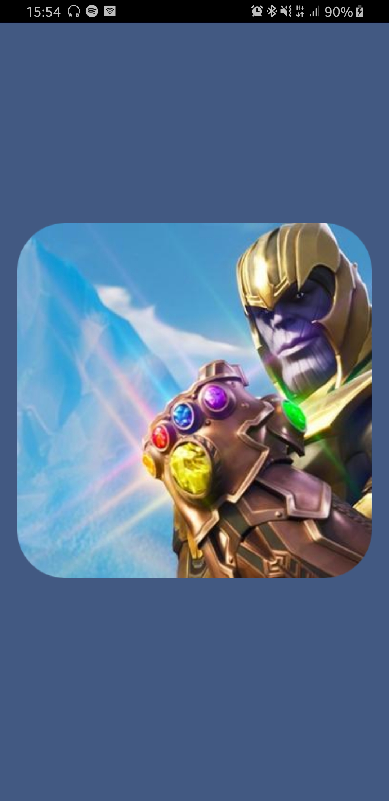
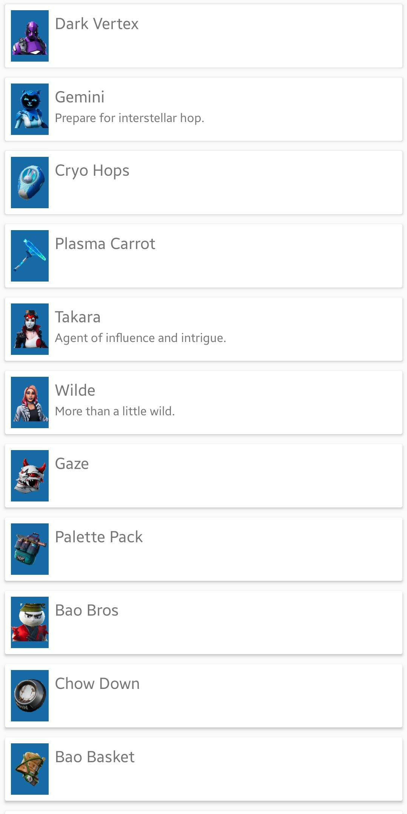
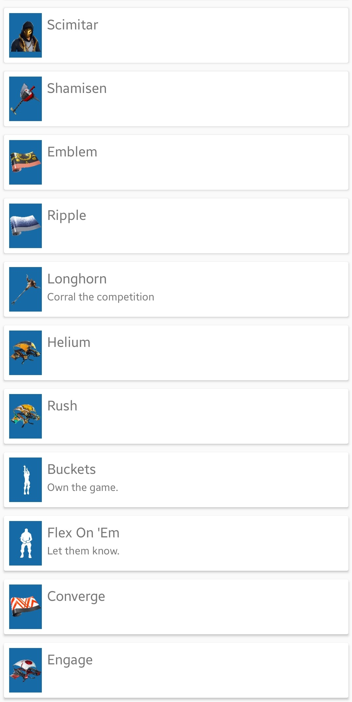
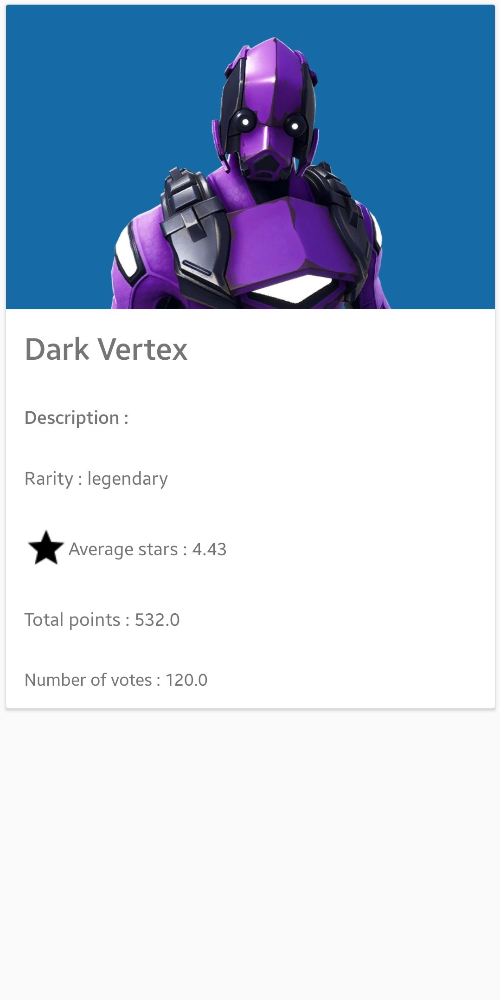
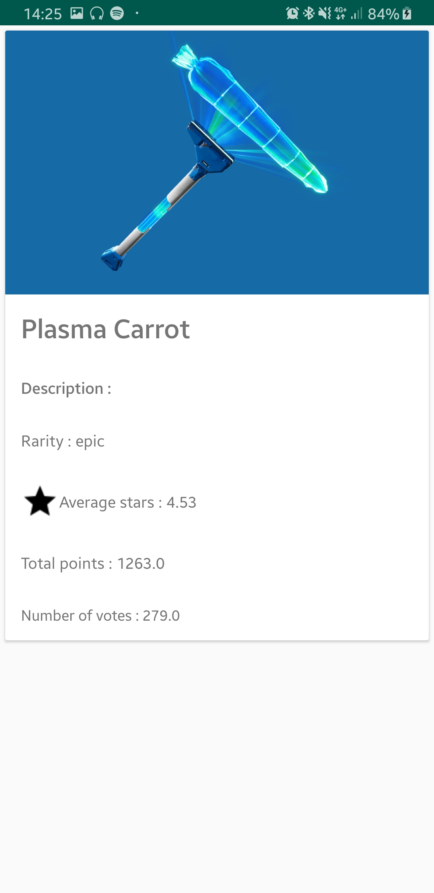

# Application Fortnite


## Auteur

* Rémi Truong 3A CFA


## Présentation 
Simple projet démontrant l'utilisation de l'architecture MVC et d'appel REST d'une API dans une application android.

Cette application affiche les prochains éléments  disponible sur le jeu Fortnite.
Elle utilise une API qui permet de récupérer la liste des éléments prochainement disponible et s'actualise à chaque mise à jour du jeu.

## Prérequis

* Installation d'Android Studio ou IntelliJ
* Récupérer le projet 
```bash
git clone https://github.com/remitruong/fortnite.git
```

## Fonctionnalités

* Architecture MVC
* Appel d'une API Rest
* Stockage des données en cache
* 3 écrans : 1 SplashScreen et 2 activités
    - Affichage d'une liste dans un RecyclerView 
    - Affichage du détail de l'item de la liste
* Gitflow
* Animation entre les écrans
* Application des principes du design Material : 
    - CardView
    - Icon
    - liste
* Utilisation de plusieurs design pattern : 
    - Singleton
    - Injection de dépendance
    - Adapter et Facade
* Héritage


## L'application :

### Premier écran 

* Splash screen affichant Thanos 


### Ecran principal

* Affiche la liste des prochains éléments disponible sur le jeu

 

### Ecran secondaire

* Affiche les détails de l'élément dans une CardView

 


